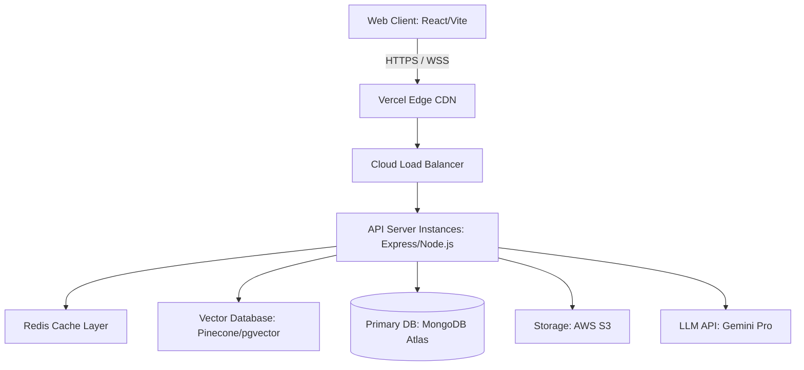

# System Architecture & Technical Specifications
## StudyOS: Your Complete Preparation Operating System

This document outlines the architectural blueprints, security protocols, performance optimizations, accessibility configurations, and mobile app roadmap.

---

## 1. High-Level System Architecture



### Component Details
- **Frontend Layer:** Single Page Application (SPA) built using React, TypeScript, and Vite. Static assets are delivered globally via Vercel's CDN.
- **Backend API Layer:** Stateless Express.js application running inside Docker containers on AWS ECS/Render, scaling horizontally behind a load balancer.
- **Cache Layer:** Redis cluster managing session blacklists, verification OTP states, and database query cache blocks.
- **AI Vector Search:** Vector embeddings generated via embeddings models stored in Pinecone/pgvector to query user study notes contexts in real-time.

---

## 2. Security Design (Section 10)

### Token & Session Lifecycle Management
- **Access Tokens:** Short-lived JWTs (15-minute expiry) containing user roles and ID signatures. Passed in standard `Authorization: Bearer` headers.
- **Refresh Tokens:** Long-lived JWTs (30-day expiry) stored in secure, HTTP-only, SameSite=Strict cookies. Used to issue new access tokens upon expiry.
- **Token Blacklisting:** Revoked refresh tokens (upon user logout or session termination) are cached in Redis with a TTL matching the token's remaining lifespan.

### Registration & Login Verification
- **Email OTP:** Registration triggers a 6-digit cryptographic random OTP sent via SMTP. The hashed OTP is cached in Redis with a 5-minute expiration window.
- **SSO Authentication:** Secure OAuth 2.0 flow using Google Cloud services. User profiles are verified using Google's public key certificates.

### API & Middleware Protections
- **Rate Limiting:** Express middleware limits incoming IP requests to 100 queries per minute. Authentication paths are restricted to 5 attempts per 10 minutes to prevent brute-force attacks.
- **Helmet Headers:** Integrated to set secure HTTP response headers:
  - Content Security Policy (CSP) blocking unauthorized script injections.
  - X-Frame-Options set to `DENY` to prevent clickjacking attacks.
- **CORS Configuration:** Explicitly configured origin filters matching only verified client subdomains. `Access-Control-Allow-Credentials` is enabled for HTTP-only cookies.
- **Data Encryptions:** Passwords processed using Bcrypt hashing with a cost factor of 12. Sensitive fields in database tables (e.g., MFA secrets) encrypted at rest using AES-256-GCM.
- **CSRF Strategy:** API requests requiring authentication leverage custom headers (`X-Requested-With`) combined with strict cookie validation attributes to block cross-site request forgery.

---

## 3. Performance & Scaling Strategies (Section 11)

### Caching Layers
- **Database Query Caching:** Redis caches high-read, low-write queries (e.g., standard syllabi templates, user settings configurations) using a Cache-Aside strategy (1-hour TTL).
- **HTTP Caching:** Static assets are served with long-term cache headers (`Cache-Control: public, max-age=31536000`), automatically invalidated via build hashing.

### Code & Asset Optimizations
- **Lazy Loading & Code Splitting:** Built using React's `lazy` and `Suspense` frameworks. Route-based code splitting ensures dashboard assets are loaded separately from initial landing page components:
  ```typescript
  const NotesWorkspace = lazy(() => import('@/pages/notes-workspace'));
  ```
- **Virtual Lists:** Pagination models applied using cursor-based keys for long lists (e.g., detailed study logs logs database).
- **Image Compressions:** User-uploaded screenshots for mock tests are processed on the backend using `sharp`, compressing uploads into WebP formats before saving to AWS S3.

---

## 4. Accessibility Implementations (Section 12)

### WCAG 2.1 AA Compliance Checklist
- **Color Contrast:** Foreground text-to-background contrast ratios maintained at $\ge 4.5:1$ for normal text and $\ge 3.0:1$ for large headings.
- **Keyboard Navigation:** All interactive dashboard controls (timer buttons, calendar slots, notes dropdowns) are navigable using standard `Tab`, `Space`, and `Enter` sequences. Focus states are visually highlighted.
- **ARIA Attributes:** Semantic HTML elements enriched with dynamic labels:
  ```html
  <button aria-label="Start Pomodoro focus timer" aria-live="polite">
    Start Timer
  </button>
  ```
- **Screen Reader Support:** Document structures utilize strict landmark tags (`<header>`, `<nav>`, `<main>`, `<footer>`) with descriptive page-level headers (`<h1>` to `<h6>`).

---

## 5. Future Mobile App Architecture (Section 15)

To prepare for cross-platform expansion in subsequent release cycles, StudyOS adopts a decoupled API strategy compatible with React Native:

- **Shared State Architecture:** Business logic, API clients, validation rules, and utilities are bundled into a `shared/` package (Monorepo setup).
- **Universal APIs:** Access is unified through identical JWT authorization headers. No state is tied to browser-specific concepts like `window` or `document`.
- **Offline Resilience:** React Native builds can leverage `WatermelonDB` or SQLite, mirroring the indexed cache schemas mapped on the web platform.
