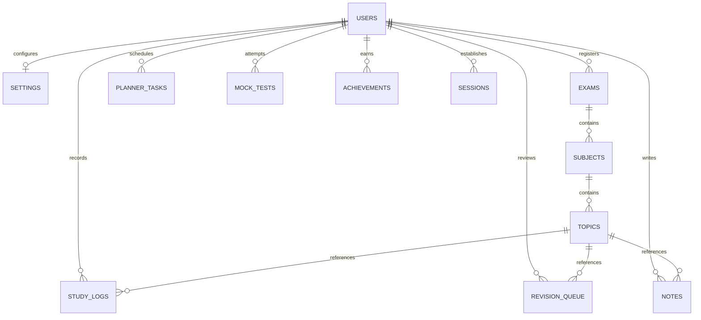

# Database Schema
## StudyOS: Your Complete Preparation Operating System

This document outlines the MongoDB collection designs, field descriptions, relational links, and validation constraints for StudyOS.

---

## 1. Database Entity Relationship Diagram



---

## 2. Collection Definitions

### Users
Stores account metadata, authentication status, and gamification profiles.
```json
{
  "_id": "ObjectId",
  "name": "String",
  "email": "String",
  "passwordHash": "String",
  "mfaEnabled": "Boolean",
  "mfaSecret": "String",
  "xp": "Number",
  "level": "Number",
  "streakCount": "Number",
  "lastStudyDate": "Date",
  "createdAt": "Date",
  "updatedAt": "Date"
}
```

### Exams
Represents the test target parameters configured by a user.
```json
{
  "_id": "ObjectId",
  "userId": "ObjectId",
  "name": "String",
  "targetDate": "Date",
  "isCustom": "Boolean",
  "dailyTargetMinutes": "Number",
  "createdAt": "Date"
}
```

### Subjects
Represents secondary chapters nested within an exam.
```json
{
  "_id": "ObjectId",
  "examId": "ObjectId",
  "name": "String",
  "weightage": "Number",
  "color": "String",
  "createdAt": "Date"
}
```

### Topics
Granular elements of subjects detailing completion statuses.
```json
{
  "_id": "ObjectId",
  "subjectId": "ObjectId",
  "name": "String",
  "difficulty": "String",
  "importance": "String",
  "status": "String",
  "revisionCount": "Number",
  "createdAt": "Date",
  "updatedAt": "Date"
}
```

### StudySessions
Represents ongoing timer tracking states to guard session continuity.
```json
{
  "_id": "ObjectId",
  "userId": "ObjectId",
  "startTime": "Date",
  "type": "String",
  "linkedTopicId": "ObjectId",
  "status": "String"
}
```

### StudyLogs
Historical data of successfully completed focus timers.
```json
{
  "_id": "ObjectId",
  "userId": "ObjectId",
  "topicId": "ObjectId",
  "durationSeconds": "Number",
  "focusRating": "Number",
  "sessionNote": "String",
  "timestamp": "Date"
}
```

### PlannerTasks
Items representing calendar blocks.
```json
{
  "_id": "ObjectId",
  "userId": "ObjectId",
  "topicId": "ObjectId",
  "title": "String",
  "startTime": "Date",
  "endTime": "Date",
  "priority": "String",
  "isCompleted": "Boolean",
  "createdAt": "Date"
}
```

### Notes
Markdown files written by users.
```json
{
  "_id": "ObjectId",
  "userId": "ObjectId",
  "topicId": "ObjectId",
  "title": "String",
  "content": "String",
  "interlinkedNoteIds": ["ObjectId"],
  "createdAt": "Date",
  "updatedAt": "Date"
}
```

### Notifications
Logs showing scheduled user alerts.
```json
{
  "_id": "ObjectId",
  "userId": "ObjectId",
  "type": "String",
  "message": "String",
  "isRead": "Boolean",
  "triggerTime": "Date"
}
```

### RevisionQueue
Tracks reviews linked to spaced repetition.
```json
{
  "_id": "ObjectId",
  "userId": "ObjectId",
  "topicId": "ObjectId",
  "noteId": "ObjectId",
  "repetitionNumber": "Number",
  "easeFactor": "Number",
  "intervalDays": "Number",
  "nextReviewDate": "Date"
}
```

### MockTests
Logbook records tracking scoring metrics.
```json
{
  "_id": "ObjectId",
  "userId": "ObjectId",
  "examId": "ObjectId",
  "title": "String",
  "marksObtained": "Number",
  "totalMarks": "Number",
  "durationMinutes": "Number",
  "sectionsBreakdown": [
    {
      "name": "String",
      "marks": "Number",
      "incorrectCount": "Number"
    }
  ],
  "dateAttempted": "Date"
}
```

### Reports
Aggregated document summaries for downloads.
```json
{
  "_id": "ObjectId",
  "userId": "ObjectId",
  "examId": "ObjectId",
  "dateGenerated": "Date",
  "studyTimeTotal": "Number",
  "topicsFinishedCount": "Number",
  "insightsText": "String",
  "pdfUrl": "String"
}
```

### Achievements
Record logs tracking unlocked achievements.
```json
{
  "_id": "ObjectId",
  "userId": "ObjectId",
  "badgeKey": "String",
  "unlockedAt": "Date"
}
```

### Settings
Preferences configurations.
```json
{
  "_id": "ObjectId",
  "userId": "ObjectId",
  "theme": "String",
  "dailyTargetHours": "Number",
  "emailDigestEnabled": "Boolean",
  "pushNotificationsEnabled": "Boolean"
}
```

### Sessions
Token tracking maps preventing session hijackings.
```json
{
  "_id": "ObjectId",
  "userId": "ObjectId",
  "refreshToken": "String",
  "device": "String",
  "ipAddress": "String",
  "expiresAt": "Date"
}
```

---

## 3. Database Indexes

To maintain performance SLA levels below 200ms, the following indexes are required:

| Collection | Index Key | Index Type | Purpose |
| :--- | :--- | :--- | :--- |
| **Users** | `email` | Unique Single Field | Speeds up credentials checks and auth routines. |
| **Exams** | `userId` | Single Field | Speeds up dashboard workspace assembly queries. |
| **Subjects** | `examId` | Single Field | Speeds up topic hierarchy calls. |
| **Topics** | `subjectId` | Single Field | Speeds up topic retrieval. |
| **StudyLogs** | `userId`, `timestamp` | Compound Index | Optimizes time log visual charts lookup. |
| **PlannerTasks** | `userId`, `startTime` | Compound Index | Speeds up weekly planner grid loads. |
| **RevisionQueue** | `userId`, `nextReviewDate` | Compound Index | Pulls active review list items due for study. |
| **Sessions** | `refreshToken` | Single Field (Hashed) | Fast token refresh queries. |
| **Sessions** | `expiresAt` | Single TTL Index | Automatically deletes expired session records. |

---

## 4. Schema Validations (MongoDB JSON Schema)

### Users Collection Schema Validation
```json
{
  "$jsonSchema": {
    "bsonType": "object",
    "required": [ "name", "email", "passwordHash" ],
    "properties": {
      "name": {
        "bsonType": "string",
        "description": "Must be a string and is required"
      },
      "email": {
        "bsonType": "string",
        "pattern": "^[a-zA-Z0-9._%+-]+@[a-zA-Z0-9.-]+\\.[a-zA-Z]{2,}$",
        "description": "Must be a valid email string and is required"
      },
      "passwordHash": {
        "bsonType": "string",
        "minLength": 60,
        "description": "Must be a Bcrypt hash string"
      }
    }
  }
}
```

### StudyLogs Collection Schema Validation
```json
{
  "$jsonSchema": {
    "bsonType": "object",
    "required": [ "userId", "topicId", "durationSeconds", "focusRating" ],
    "properties": {
      "userId": { "bsonType": "objectId" },
      "topicId": { "bsonType": "objectId" },
      "durationSeconds": {
        "bsonType": "number",
        "minimum": 1,
        "description": "Must be a positive integer representing focus duration"
      },
      "focusRating": {
        "bsonType": "number",
        "minimum": 1,
        "maximum": 5,
        "description": "Focus rating out of 5 stars"
      }
    }
  }
}
```
