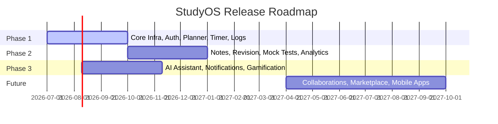

# Feature Specification Document

## StudyOS: Your Complete Preparation Operating System

This document outlines the granular feature specifications for StudyOS, categorized across 20 core areas.

---

## 1. Authentication

### Feature 1.1: Local Auth (Email/Password)

- **Priority:** P0
- **User Value:** Allows users to create a private account and securely access their study logs, planner, and notes from any device.
- **Dependencies:** Database user schema, email service provider (SMTP/SendGrid) for confirmation emails.
- **Acceptance Criteria:**
  - **AC-1:** User can register with email, name, and password. Password must be checked for minimum complexity (8 characters, 1 digit, 1 special character).
  - **AC-2:** User must receive an activation email with a verification link that expires in 24 hours.
  - **AC-3:** User can log in with valid credentials and receive a JWT. Invalid logins return a standardized error message.

### Feature 1.2: OAuth 2.0 (Google & GitHub SSO)

- **Priority:** P0
- **User Value:** Provides a frictionless signup/login flow using existing Google or GitHub accounts.
- **Dependencies:** Google Cloud Console credentials, GitHub Developer settings, OAuth client library.
- **Acceptance Criteria:**
  - **AC-1:** Dashboard login screen displays "Continue with Google" and "Continue with GitHub" options.
  - **AC-2:** Successful external authentication redirects user to the dashboard and automatically creates a StudyOS profile if one does not exist.
  - **AC-3:** Auth tokens are safely processed and stored in secure cookies.

### Feature 1.3: Multi-Factor Authentication (MFA)

- **Priority:** P1
- **User Value:** Adds a second security layer, protecting study metrics and notes from unauthorized access.
- **Dependencies:** TOTP library, User Settings page.
- **Acceptance Criteria:**
  - **AC-1:** Users can toggle MFA on/off in Security Settings.
  - **AC-2:** Enabling MFA generates a QR code to be scanned using standard authenticator apps (Google Authenticator, Authy).
  - **AC-3:** Once enabled, subsequent login attempts prompt for a valid 6-digit TOTP code before granting access.

---

## 2. Dashboard

### Feature 2.1: Unified Progress & Streaks Widget

- **Priority:** P0
- **User Value:** Shows progress toward the target exam and displays active study streaks to build consistency.
- **Dependencies:** Exam Management, Study Logs database.
- **Acceptance Criteria:**
  - **AC-1:** Dashboard displays a circular progress card showing the percentage of overall syllabus completion.
  - **AC-2:** A flame icon displays the current study streak (consecutive days with $\ge 30$ minutes logged).
  - **AC-3:** The streak counter increments daily or resets if a day is missed without a streak freeze active.

### Feature 2.2: Focus Tasks Widget

- **Priority:** P0
- **User Value:** Displays the top three high-priority tasks due today, helping users avoid decision fatigue.
- **Dependencies:** Daily Planner database schema.
- **Acceptance Criteria:**
  - **AC-1:** Displays a simplified list of today's P0 and P1 study tasks.
  - **AC-2:** Users can mark tasks as completed directly from the widget.
  - **AC-3:** Checked tasks instantly update the database state and play a subtle success chime.

### Feature 2.3: Quick Timer Widget

- **Priority:** P0
- **User Value:** Allows quick access to start a focus session directly from the home screen.
- **Dependencies:** Study Timer system.
- **Acceptance Criteria:**
  - **AC-1:** Widget displays a simple 25-minute Pomodoro toggle on the dashboard.
  - **AC-2:** Clicking "Start" initiates the countdown immediately.
  - **AC-3:** A mini-progress line shows time elapsed, expanding to full-screen mode when clicked.

---

## 3. Exam Management

### Feature 3.1: Pre-Configured Exam Selection

- **Priority:** P0
- **User Value:** Saves setup time by letting aspirants load pre-built syllabi for exams like GATE, UPSC, CAT, etc.
- **Dependencies:** Seeded database containing official exam syllabi.
- **Acceptance Criteria:**
  - **AC-1:** On onboarding, user is presented with a list of supported exams (GATE, UPSC, CAT, SSC, Banking, Semester, Placement).
  - **AC-2:** Selecting an exam automatically imports its full subject, topic, and sub-topic hierarchy into the user's workspace.

### Feature 3.2: Custom Exam Builder

- **Priority:** P0
- **User Value:** Allows students of niche or regional exams to structure custom templates matching their targets.
- **Dependencies:** Hierarchical subject/topic creation forms.
- **Acceptance Criteria:**
  - **AC-1:** Users can click "Create Custom Exam" and enter Exam Name, Description, and Target Date.
  - **AC-2:** Users can manually add, rename, and delete custom subjects and topics.
  - **AC-3:** The custom exam is saved in the user's personal database registry.

### Feature 3.3: Multi-Exam Coexistence

- **Priority:** P1
- **User Value:** Allows students to study for placement prep and semester exams concurrently without mixing records.
- **Dependencies:** Workspace isolation layer in database queries.
- **Acceptance Criteria:**
  - **AC-1:** Dashboard header contains a dropdown selector to toggle between active exams.
  - **AC-2:** Switching the exam context refreshes the syllabus tracker, planner, and analytics to show metrics _only_ for the active exam.

---

## 4. Subject Management

### Feature 4.1: Subject Weightage Mapping

- **Priority:** P0
- **User Value:** Helps users allocate study hours based on the relative importance of each subject in the exam.
- **Dependencies:** Exam Management, Syllabus Tracking.
- **Acceptance Criteria:**
  - **AC-1:** Users can assign a weightage percentage ($0\%$ to $100\%$) to each subject within an exam.
  - **AC-2:** The system validates that the total weightage of all subjects in an exam does not exceed $100\%$ (triggering a warning banner if it does).
  - **AC-3:** Weightages are factored into the global syllabus progress calculations.

### Feature 4.2: Visual Color Coding

- **Priority:** P0
- **User Value:** Makes the interface visually distinct, color-coding study tasks, charts, and logs by subject.
- **Dependencies:** Subject schema UI colors.
- **Acceptance Criteria:**
  - **AC-1:** When creating or editing a subject, users can select from a curated 8-color palette (HEX values).
  - **AC-2:** Selected colors are applied to calendar blocks, analytics pie charts, and topic listings associated with that subject.

---

## 5. Topic Management

### Feature 5.1: Hierarchical Topic Tree

- **Priority:** P0
- **User Value:** Breaks subjects down into manageable chapters and sub-topics, preventing cognitive overload.
- **Dependencies:** Subject Management.
- **Acceptance Criteria:**
  - **AC-1:** Clicking on a subject expands to show a nested tree of Topics (Chapter level) and Sub-topics.
  - **AC-2:** Users can toggle state status between `Not Started`, `In Progress`, `Completed`, and `Mastered`.
  - **AC-3:** Children states automatically bubble up to affect the parent topic status.

### Feature 5.2: Difficulty & Importance Tagging

- **Priority:** P1
- **User Value:** Prioritizes topics that are high-yield and highly difficult for early intervention.
- **Dependencies:** Topic Tree.
- **Acceptance Criteria:**
  - **AC-1:** Users can tag topics with Difficulty (`Easy`, `Medium`, `Hard`) and Importance (`Low`, `Medium`, `High`).
  - **AC-2:** The topic view includes sorting and filtering mechanisms based on these tags.

---

## 6. Syllabus Tracking

### Feature 6.1: Progress & Forecast Analytics

- **Priority:** P0
- **User Value:** Offers realistic projections of completion dates based on current velocity, managing expectations.
- **Dependencies:** Topic Management states, Study Logs.
- **Acceptance Criteria:**
  - **AC-1:** Renders a progress bar showing total completion based on weightages and topic states.
  - **AC-2:** Displays a "Completion Forecast" indicating the estimated date the syllabus will hit $100\%$ based on the average weekly study logs velocity.

### Feature 6.2: Backlog & Delay Flags

- **Priority:** P1
- **User Value:** Alerts students to topics they have been stuck on for too long.
- **Dependencies:** Topic state timestamp history.
- **Acceptance Criteria:**
  - **AC-1:** Topics in `In Progress` status for longer than 14 consecutive days are flagged with a visual backlog indicator (red warning label).
  - **AC-2:** Dashboard displays a "Resolve Backlogs" alert suggesting revision or rescheduling.

---

## 7. Daily Planner

### Feature 7.1: Interactive Time-Blocking Calendar

- **Priority:** P0
- **User Value:** Helps users plan their days hour-by-hour to ensure structured study routines.
- **Dependencies:** Task schema, Frontend UI calendar component.
- **Acceptance Criteria:**
  - **AC-1:** Calendar interface rendering Day, Week, and Month views.
  - **AC-2:** Users can click on a time slot to create a time block, choosing a specific subject/topic to study.
  - **AC-3:** Active study blocks change color to match the associated subject.

### Feature 7.2: Drag-and-Drop Task Scheduling

- **Priority:** P1
- **User Value:** Saves planning time by letting users drag unscheduled topics onto calendar slots.
- **Dependencies:** Topic Management, Calendar.
- **Acceptance Criteria:**
  - **AC-1:** Sidebar displays a list of "Unscheduled Tasks".
  - **AC-2:** User can drag any unscheduled task card onto a calendar time slot.
  - **AC-3:** On drop, a calendar event is created, and the task status is updated in the database.

### Feature 7.3: External Calendar Integration

- **Priority:** P2
- **User Value:** Prevents scheduling clashes by overlaying personal calendar appointments onto the study calendar.
- **Dependencies:** Google Calendar API, iCal feed parsers.
- **Acceptance Criteria:**
  - **AC-1:** Settings page contains "Connect Google Calendar" authorization button.
  - **AC-2:** Once authorized, external events are loaded in read-only format as gray blocks on the StudyOS calendar.

---

## 8. Study Timer

### Feature 8.1: Integrated Pomodoro Timer

- **Priority:** P0
- **User Value:** Boosts focus using structured intervals, minimizing distraction during study blocks.
- **Dependencies:** Front-end timer state, Web audio API.
- **Acceptance Criteria:**
  - **AC-1:** Timer supports default Pomodoro modes (25m/5m, 50m/10m) and custom interval configurations.
  - **AC-2:** Emits audio notification when work or break intervals complete.
  - **AC-3:** Timer state persists across page refreshes during an active session using localStorage/sessionStorage.

### Feature 8.2: Stopwatch Mode

- **Priority:** P0
- **User Value:** Caters to long-form focus sessions (e.g., writing full-length mock tests).
- **Dependencies:** Timer module.
- **Acceptance Criteria:**
  - **AC-1:** Users can toggle from Pomodoro to Stopwatch view.
  - **AC-2:** Stopwatch counts upward from zero and records elapsed time in seconds.
  - **AC-3:** Users can pause/resume and stop the timer, triggering the Study Log modal.

### Feature 8.3: Strict Mode & Tab Blocklist

- **Priority:** P1
- **User Value:** Minimizes digital distraction by enforcing page focus during active study blocks.
- **Dependencies:** Page visibility API, Browser focus handlers.
- **Acceptance Criteria:**
  - **AC-1:** Enabling "Strict Mode" checks if the user changes browser tabs.
  - **AC-2:** If the user leaves the tab for more than 10 seconds, the active timer pauses and issues an warning notification.
  - **AC-3:** Provides option to run in full-screen mode, locking interaction to StudyOS.

---

## 9. Study Logs

### Feature 9.1: Automatic Focus Logging

- **Priority:** P0
- **User Value:** Automatically tracks studied hours without requiring manual spreadsheet entry.
- **Dependencies:** Study Timer, Topic Tree database.
- **Acceptance Criteria:**
  - **AC-1:** Upon timer completion or manual stop, a modal prompts: "Link this session to a topic".
  - **AC-2:** Selecting a topic, rating focus (1-5 stars), and clicking "Save" creates a Study Log database entry.
  - **AC-3:** Study logs immediately update weekly study chart progress.

### Feature 9.2: Retroactive Manual Logging

- **Priority:** P1
- **User Value:** Allows tracking of library sessions, offline coaching classes, or physical reading.
- **Dependencies:** Logs database.
- **Acceptance Criteria:**
  - **AC-1:** User can click "Add Manual Log" in the logs dashboard.
  - **AC-2:** Form requires: Date, Time range (Start/End), Subject, Topic, and Description.
  - **AC-3:** Manual logs are marked with a distinct badge in logs history to differentiate them from timed sessions.

---

## 10. Notes

### Feature 10.1: Rich Markdown & Code Editor

- **Priority:** P1
- **User Value:** Provides a flexible workspace to write summaries, code snippets, and math equations without external apps.
- **Dependencies:** Markdown parser, LaTeX engine (KaTeX/MathJax), code formatting modules.
- **Acceptance Criteria:**
  - **AC-1:** Note editor allows real-time rendering of standard markdown headers, lists, links, and bold/italic elements.
  - **AC-2:** Standard math environments (e.g., `$$ E=mc^2 $$`) render standard LaTeX math blocks.
  - **AC-3:** Code blocks display syntax highlighting for programming languages based on markdown identifiers (e.g., ` ```python `).

### Feature 10.2: Wiki-Style Interlinking

- **Priority:** P1
- **User Value:** Allows creating a personalized knowledge network by linking topics together.
- **Dependencies:** Notes database parser.
- **Acceptance Criteria:**
  - **AC-1:** Typing `[[` inside the editor displays an autocompletion search popup of existing note titles and topic names.
  - **AC-2:** Selecting an item creates an internal wiki link.
  - **AC-3:** Clicking the link in read-only mode navigates the user directly to the targeted note or topic overview page.

### Feature 10.3: Text-to-Flashcard Direct Promotion

- **Priority:** P2
- **User Value:** Speeds up revision card creation directly from study notes.
- **Dependencies:** Notes editor, Flashcard database schema.
- **Acceptance Criteria:**
  - **AC-1:** Highlighting text in the notes editor displays a quick-action formatting bubble containing "Convert to Flashcard".
  - **AC-2:** Selecting "Convert to Flashcard" opens a split pop-up window: Front (pre-filled with context) and Back (pre-filled with highlighted text).
  - **AC-3:** Saving creates an active card in the Revision Planner deck linked to the parent note.

---

## 11. Notification Center

### Feature 11.1: In-App Alerts

- **Priority:** P0
- **User Value:** Informs the user of system events and immediate planning tasks within the app.
- **Dependencies:** Notifications database schema.
- **Acceptance Criteria:**
  - **AC-1:** Top header displays a bell icon with an unread counts badge.
  - **AC-2:** Clicking the bell opens a panel listing recent alerts (e.g., "Mock Test 2 Review Overdue", "Study streak milestone hit!").
  - **AC-3:** Users can click "Mark all as read" to clear indicators.

### Feature 11.2: Daily Agenda Email

- **Priority:** P1
- **User Value:** Sends a morning snapshot of the scheduled day directly to the user's inbox to encourage daily alignment.
- **Dependencies:** Cron scheduler, Email template engines, SendGrid/SMTP.
- **Acceptance Criteria:**
  - **AC-1:** Cron job runs daily at 07:00 AM local time based on user profile time zones.
  - **AC-2:** Compiles planned calendar tasks, revision list due today, and current streak state.
  - **AC-3:** Dispatches HTML email. Users can opt out of this email in Settings.

### Feature 11.3: Browser Push notifications

- **Priority:** P1
- **User Value:** Triggers desktop/mobile browser alerts when timers finish or tasks are due.
- **Dependencies:** Web Push API, Service Workers.
- **Acceptance Criteria:**
  - **AC-1:** Pop-up requests permission for notifications on first onboarding.
  - **AC-2:** If granted, pushes alerts when focus timers hit 0 or scheduled tasks begin.
  - **AC-3:** Alerts display actionable quick-replies (e.g., "Start Break", "Delay 10 mins").

---

## 12. Revision Planner

### Feature 12.1: Spaced Repetition Engine (SM-2 adaptation)

- **Priority:** P0
- **User Value:** Retains learned information scientifically by scheduling reviews just before memory fades.
- **Dependencies:** Flashcard database, Cron schedule logic.
- **Acceptance Criteria:**
  - **AC-1:** Integrates the SuperMemo-2 (SM-2) algorithm calculating: Repetitions (n), Ease Factor (EF), and Interval (I).
  - **AC-2:** When a user reviews a card and rates recall quality (1 to 5), the system recalculates the next review date.
  - **AC-3:** Revision tasks automatically update and surface in the dashboard "Revision Queue" on their due dates.

### Feature 12.2: Flashcard Review Interface

- **Priority:** P1
- **User Value:** Provides a clean interface to test recall quickly.
- **Dependencies:** Revision Planner engine.
- **Acceptance Criteria:**
  - **AC-1:** Opens a cards carousel showing the question (front of card).
  - **AC-2:** Clicking "Reveal Answer" flips the card with a clean 3D rotation animation, showing the back.
  - **AC-3:** Displays five rating buttons: `Forgot (1)`, `Struggled (2)`, `Recall (3)`, `Easy (4)`, `Mastered (5)`. Selecting a rating saves the card state and displays the next card in the deck.

---

## 13. Mock Tests

### Feature 13.1: Score Tracker & Diagnostic Logger

- **Priority:** P1
- **User Value:** Monitors performance trajectories on full-length mock exams.
- **Dependencies:** Exam Management.
- **Acceptance Criteria:**
  - **AC-1:** Users can click "Log Mock Test" and input: Test Title, Date, Total Marks, Marks Obtained, and Total Duration.
  - **AC-2:** Form validates that Marks Obtained does not exceed Total Marks.
  - **AC-3:** Log is saved, updating the Mock Test analytics trend line.

### Feature 13.2: Sectional Analytics & Gap Analysis

- **Priority:** P1
- **User Value:** Identifies which specific test sections (e.g., Verbal vs. Quant) pull down overall scores.
- **Dependencies:** Score Tracker database schema.
- **Acceptance Criteria:**
  - **AC-1:** Tracker form allows inputting sub-scores for specific sections.
  - **AC-2:** Analytics dashboard generates performance breakdown graphs for each section.
  - **AC-3:** Pinpoints sections performing below average relative to target requirements.

### Feature 13.3: Screenshot Error Logbook

- **Priority:** P2
- **User Value:** Collects all incorrect test questions in one searchable place for targeted correction.
- **Dependencies:** Cloud storage bucket integration (AWS S3 or Cloudinary).
- **Acceptance Criteria:**
  - **AC-1:** Users can upload screenshots of test errors.
  - **AC-2:** User tags the error with: Subject, Topic, Error Category (`Conceptual`, `Silly Mistake`, `Time Pressure`).
  - **AC-3:** Creates a searchable list of error cards that users can mark as "Corrected" once re-solved.

---

## 14. Analytics

### Feature 14.1: Study Time Distribution Charts

- **Priority:** P1
- **User Value:** Visually proves if students are spending time on the right subjects.
- **Dependencies:** Study Logs database, Chart JS / D3 library.
- **Acceptance Criteria:**
  - **AC-1:** Displays a pie/donut chart showing total study time partitioned by Subject.
  - **AC-2:** Displays a stacked bar chart mapping study time over the last 7, 30, and 90 days.
  - **AC-3:** Hovering over charts displays tooltips showing exact hours and minutes logged.

### Feature 14.2: Subject Mastery Matrix

- **Priority:** P1
- **User Value:** Prevents students from focusing exclusively on comfortable subjects instead of weak areas.
- **Dependencies:** Mock Test scores, Study logs data.
- **Acceptance Criteria:**
  - **AC-1:** Maps subjects onto a four-quadrant chart:
    - Y-Axis: Mock Test Score Avg ($0\%$ to $100\%$).
    - X-Axis: Total Logged Study Hours.
  - **AC-2:** Identifies "Time Wasters" (high hours, low scores) and "High Performers" (low hours, high scores).
  - **AC-3:** Provides text hints advising resource redistribution.

---

## 15. Reports

### Feature 15.1: Weekly Progress Review

- **Priority:** P2
- **User Value:** Summarizes performance trends to help students evaluate productivity at the end of each week.
- **Dependencies:** Analytics, Email service templates.
- **Acceptance Criteria:**
  - **AC-1:** Compiles weekly reports detailing: Total hours studied, topics completed, mock test updates, and AI suggestions.
  - **AC-2:** Sends reports every Sunday at 08:00 PM local time.
  - **AC-3:** Allows toggling subscription preferences.

### Feature 15.2: Exportable Performance PDFs

- **Priority:** P2
- **User Value:** Generates reports that can be printed or shared with teachers, parents, or academic advisors.
- **Dependencies:** PDF generation library (e.g., pdfkit, puppeteer-pdf).
- **Acceptance Criteria:**
  - **AC-1:** Button on Analytics page: "Generate PDF Report".
  - **AC-2:** Downloads a clean, branded PDF summarizing study metrics, syllabus logs, and diagnostic trends.
  - **AC-3:** PDF must render layout scales cleanly across A4 sizing.

---

## 16. AI Assistant

### Feature 16.1: RAG-based Note Doubt Solver

- **Priority:** P1
- **User Value:** Acts as a 24/7 personal tutor that answers conceptual questions using the student's own verified notes.
- **Dependencies:** Vector database integration (Pinecone/pgvector), LLM API (Gemini/OpenAI), RAG pipeline.
- **Acceptance Criteria:**
  - **AC-1:** Chat panel on Notes page allows typing natural queries.
  - **AC-2:** Returns response based on vectorized context from the user's notes database.
  - **AC-3:** Highlights and links note segments used as source context.

### Feature 16.2: AI Study Schedule Planner

- **Priority:** P1
- **User Value:** Creates an optimized schedule dynamically, adjusting to the student's available hours.
- **Dependencies:** Topic tree, Exam dates, Daily Planner calendar schema.
- **Acceptance Criteria:**
  - **AC-1:** Form asks: "How many hours can you study daily?" and "Select subjects to prioritize".
  - **AC-2:** AI processes data and returns a suggested 14-day study plan.
  - **AC-3:** Clicking "Apply Schedule" maps study tasks to the user's planner calendar automatically.

### Feature 16.3: AI-Generated Flashcards

- **Priority:** P2
- **User Value:** Speeds up revision preparation by using AI to generate high-quality question-answer decks automatically.
- **Dependencies:** LLM API, Notes database.
- **Acceptance Criteria:**
  - **AC-1:** User selects a note or topic and clicks "Generate Flashcards with AI".
  - **AC-2:** System generates 5-10 draft card proposals (Front / Back).
  - **AC-3:** User approves, edits, or discards cards before importing them to the active revision deck.

---

## 17. Achievements

### Feature 17.1: XP & Level-Up Gamification

- **Priority:** P2
- **User Value:** Keeps students motivated during long, monotonous prep cycles by adding game-like progression.
- **Dependencies:** User Profile schema.
- **Acceptance Criteria:**
  - **AC-1:** Users earn Experience Points (XP) for activities:
    - Completing a study block: 50 XP
    - Finishing a mock test log: 100 XP
    - Maintenance of daily streak: 20 XP
  - **AC-2:** Hitting threshold levels (e.g., Level = $\sqrt{\text{Total XP} / 100}$) displays a celebratory level-up banner.
  - **AC-3:** Levels and XP are displayed on the top profile dashboard header.

### Feature 17.2: Milestone Badges

- **Priority:** P2
- **User Value:** Celebrates major study milestones, creating moments of accomplishment.
- **Dependencies:** Achievements DB tables.
- **Acceptance Criteria:**
  - **AC-1:** Tracks milestones: "100 hours studied", "Perfect study streak week", "First mock test logged".
  - **AC-2:** Hitting a milestone unlocks a permanent visual badge on the user's achievements shelf.
  - **AC-3:** Clicking a badge displays the description, unlock date, and sharing options.

---

## 18. User Profile

### Feature 18.1: Profile Customization

- **Priority:** P0
- **User Value:** Allows users to personalize their account details and manage their login identities.
- **Dependencies:** Authentication, Database User table.
- **Acceptance Criteria:**
  - **AC-1:** Profile page displays name, email, target exam list, registration date, and avatar image.
  - **AC-2:** Users can update their name and upload an avatar file (PNG, JPG, max size 2MB).
  - **AC-3:** Validation prevents updating with an invalid email format or blank name fields.

### Feature 18.2: Target Settings & Daily Study Goals

- **Priority:** P0
- **User Value:** Sets targets that guide calculations for velocity charts and progress warnings.
- **Dependencies:** Profile database schema.
- **Acceptance Criteria:**
  - **AC-1:** Profile settings include "Daily Study Target" (slider scale: 1 to 16 hours).
  - **AC-2:** Weekly progress charts use this value to display green (target met) or gray (target missed) coloring.
  - **AC-3:** Users can configure target rank/score benchmarks for competitive exams.

---

## 19. Settings

### Feature 19.1: Application Preferences & Theme Switcher

- **Priority:** P0
- **User Value:** Minimizes eye strain during late-night study sessions by providing dark mode preferences.
- **Dependencies:** Front-end layout CSS variables.
- **Acceptance Criteria:**
  - **AC-1:** Settings page includes toggles for: Light Mode, Dark Mode, System Default.
  - **AC-2:** Toggling theme applies changes instantly without requiring a page refresh.
  - **AC-3:** Preferences are saved in database settings and sync across devices.

### Feature 19.2: Data Portability (Import/Export)

- **Priority:** P1
- **User Value:** Ensures users own their study logs and notes, preventing vendor lock-in.
- **Dependencies:** JSON/CSV serializer, file generation modules.
- **Acceptance Criteria:**
  - **AC-1:** Settings page contains "Export Data" button.
  - **AC-2:** Downloads a structured `.zip` containing: Notes (as individual markdown files) and Study Logs / Mock Tests (as `.csv` lists).
  - **AC-3:** "Import Data" form accepts compatible `.zip` exports, merging records into the active account.

---

## 20. Security

### Feature 20.1: JWT Security & Active Session Manager

- **Priority:** P0
- **User Value:** Secures private records by monitoring active account access locations.
- **Dependencies:** Redis/Session store, geolocation IP lookup.
- **Acceptance Criteria:**
  - **AC-1:** Tokens are signed using securely managed secrets.
  - **AC-2:** "Security Settings" displays a table of active login sessions: Browser, Device, IP, Last Active date.
  - **AC-3:** User can click "Log out from this device" or "Terminate all sessions", invalidating tokens immediately.

### Feature 20.2: Rate Limiting & Input Sanitization

- **Priority:** P0
- **User Value:** Protects the stability and performance of the app by blocking spam and security exploits.
- **Dependencies:** Middleware configurations.
- **Acceptance Criteria:**
  - **AC-1:** API routes reject requests exceeding 100 calls per minute from the same IP, returning HTTP 429.
  - **AC-2:** Rich-text input forms sanitize input to prevent malicious HTML/JS payloads from executing (XSS protection).
  - **AC-3:** Database queries use parameterized placeholders (Object Relational Mapping) to block SQL injections.

---

## Roadmap & Release Phases



### Phase 1 Features (Launch Target: Month 3)

_Focus: Foundation, Auth, and basic planning/execution loops._

- Local Auth & OAuth 2.0 (Google, GitHub)
- Basic Dashboard & Quick Timer Widget
- Exam Selection & Custom Exam Builder
- Subject Management & Hierarchy Tree
- Daily Planner Time-blocking Calendar
- Study Timer (Pomodoro/Stopwatch)
- Auto focus logging & basic log history
- Dark / Light Theme settings

### Phase 2 Features (Launch Target: Month 6)

_Focus: Note-taking, scientific revision tools, mock test integration, and deep analytics._

- Rich Markdown Note Editor (Markdown + LaTeX)
- Spaced Repetition System (SM-2 algorithm) & Card Carousel
- Mock Test Diagnostic Logger
- Study Time Distribution Charts & Mastery Matrix
- In-App notifications
- Data Import/Export (JSON/CSV)
- Security Session Manager

### Phase 3 Features (Launch Target: Month 9)

_Focus: AI integrations, notification triggers, and gamification._

- AI Note Doubt Solver (RAG integration)
- AI Study Schedule Planner
- AI Flashcard Generator
- Daily Email Digests & Web Push Notifications
- XP and Leveling engine
- Achievement Badge Shelf
- Weekly Performance PDF Reports

### Future Features (Phase 4+)

_Focus: Collaboration, scaling, and platform diversification._

- Virtual Co-Study Rooms (Live timer sharing, ambient audio, chat widgets)
- Crowd-sourced Syllabus & Flashcard Templates Marketplace
- Native iOS and Android Mobile apps with offline widget sync
- Integration with external LMS databases (Canvas, Moodle, Google Classroom)
