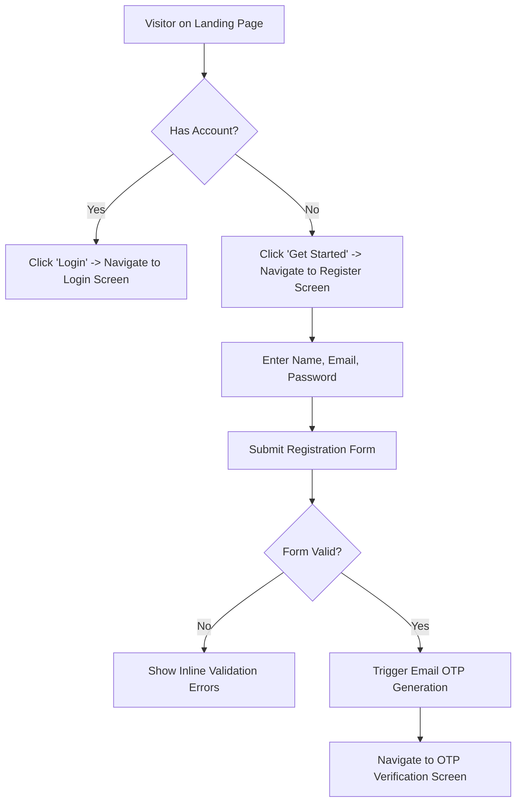
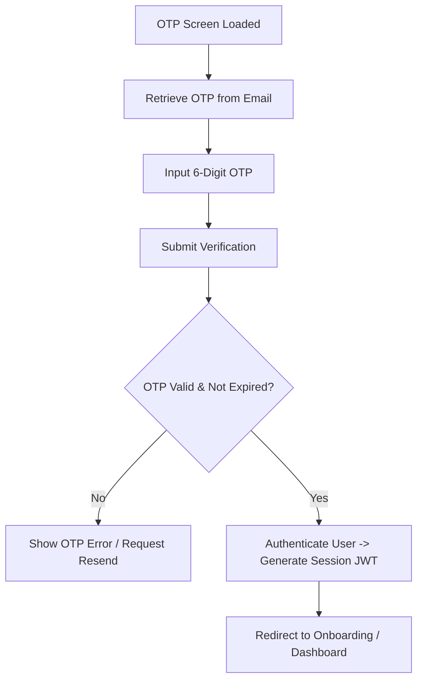
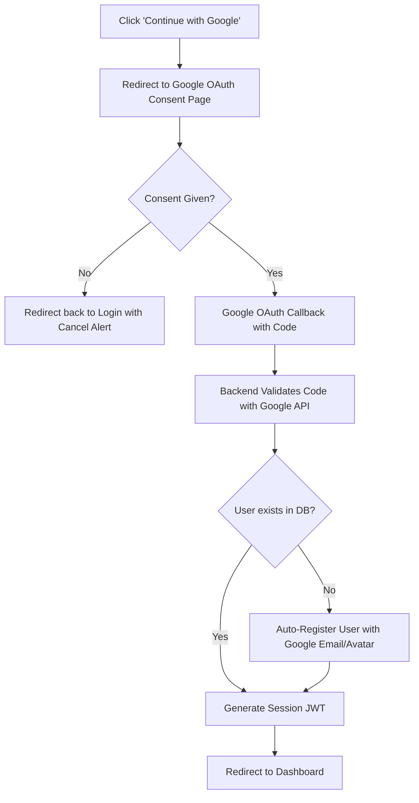
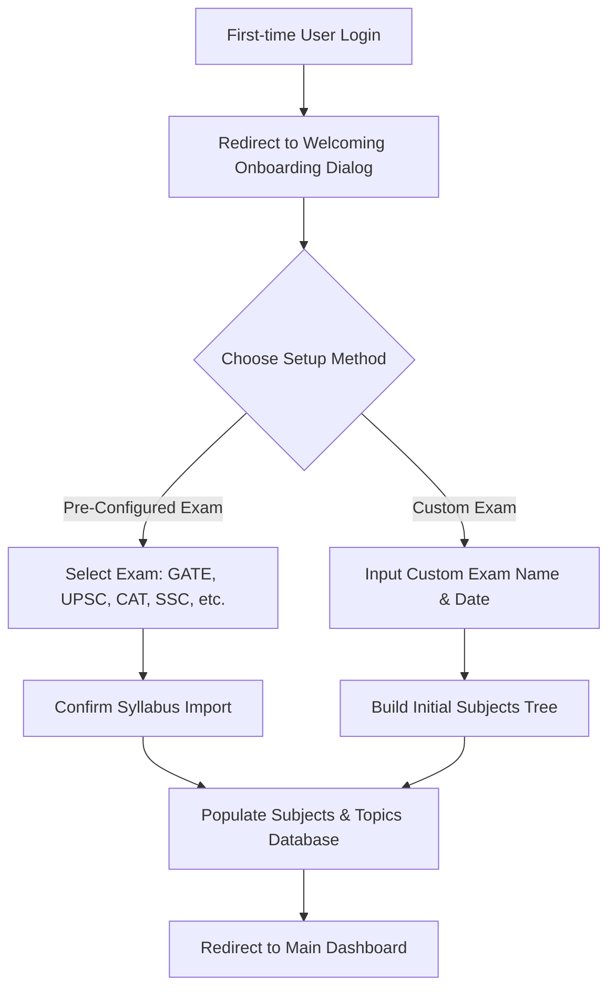
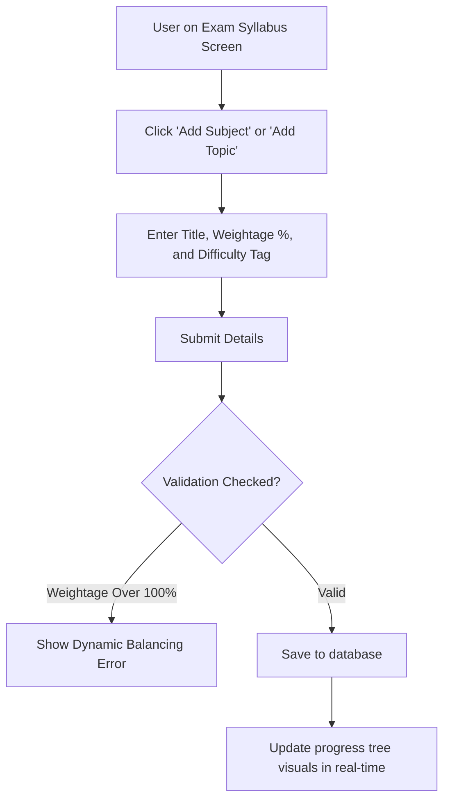
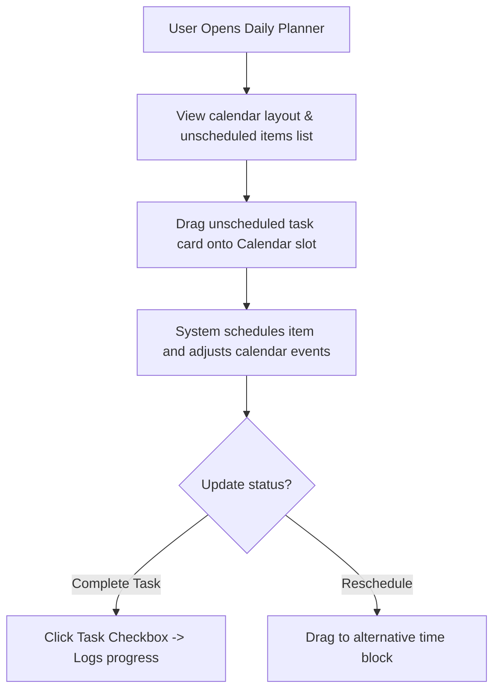
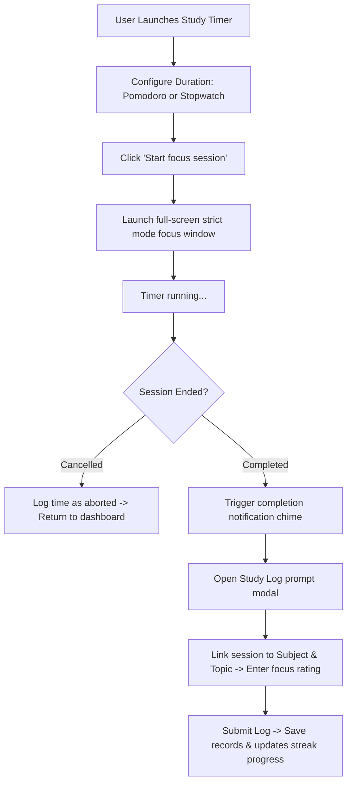
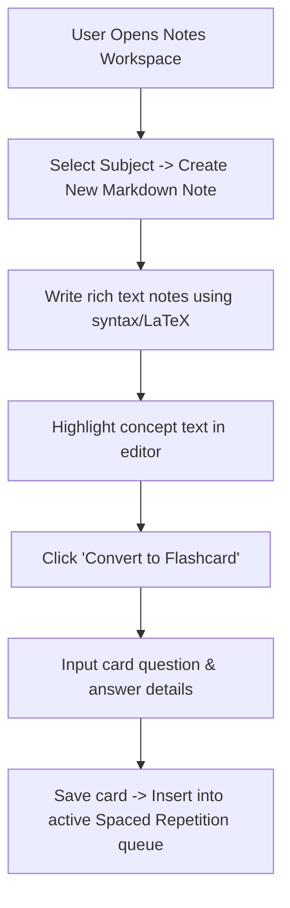
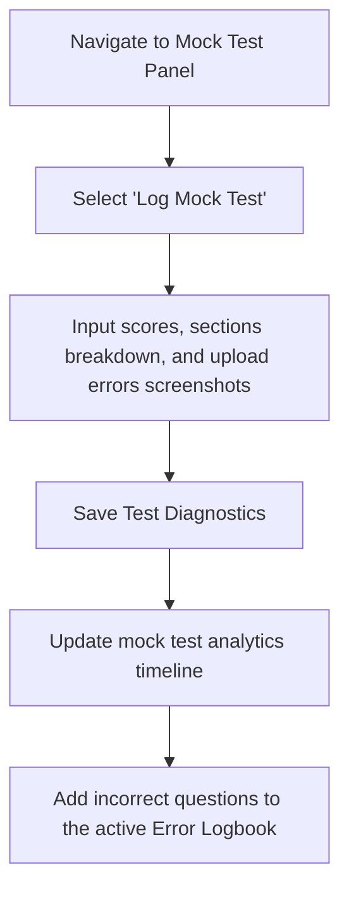
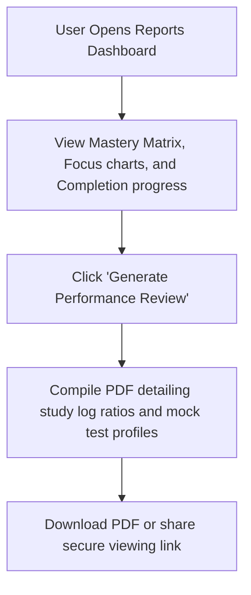

# User Flows

## StudyOS: Your Complete Preparation Operating System

This document outlines the visual and logic flows for the primary user paths within StudyOS.

---

## 1. Authentication User Flows

### Landing Page & Register Flow

### Email OTP Verification Flow

### Google Login Flow

---

## 2. Onboarding & Core Syllabus Management

### Create Exam & Syllabus Selection Flow

### Subject & Topic Configuration Flow

---

## 3. Core Productivity & Log Loops

### Daily Planner Flow

### Study Timer Focus Loop

---

## 4. Academic Review & Analytics Loops

### Notes & Flashcards Creation Flow

### Mock Test & Error Log Flow

### Reports & Analytics Flow

