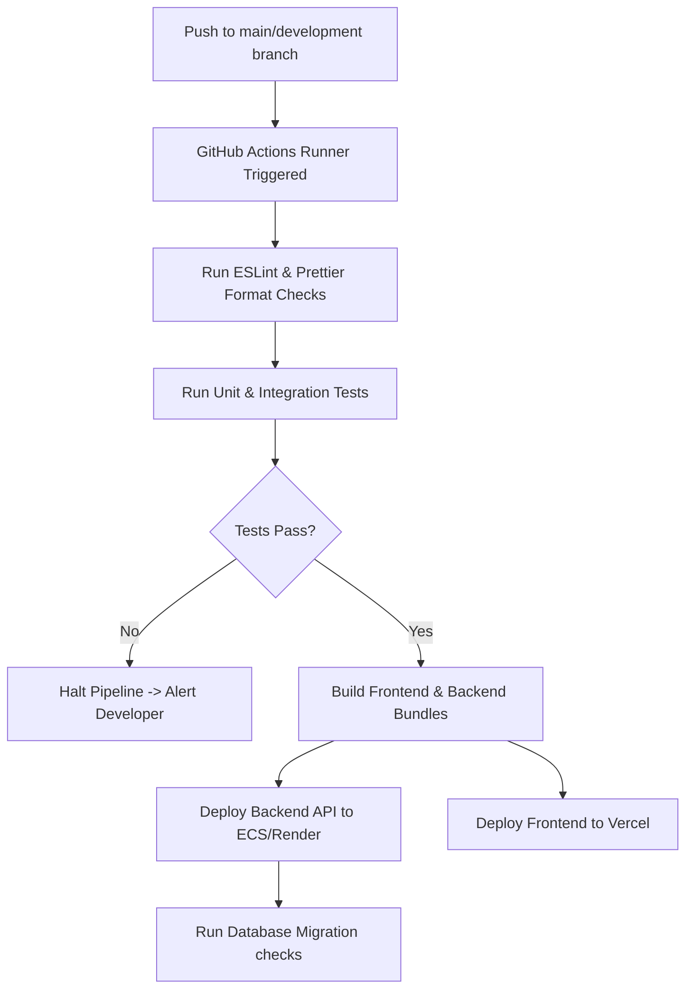

# Development Roadmap, Standards, & Deployment Plan

## StudyOS: Your Complete Preparation Operating System

This document outlines the sprint-by-sprint roadmap, software coding standards, testing strategies, and deployment architectures for StudyOS.

---

## 1. Development Roadmap (Sprint-wise)

```
Sprints (2-Week Iterations):
[Sprint 1: Core Foundation] --> [Sprint 2: Productivity Loop] --> [Sprint 3: Academic Tools] --> [Sprint 4: Analytics & AI] --> [Sprint 5: Scaling & Release]
```

### Sprint 1: Core Foundation & Auth

- **Objective:** Establish repo architecture, configure database layers, build secure authentication, and implement onboarding.
- **Deliverables:**
  - Setup boilerplate for Frontend (React/Vite/TypeScript) and Backend (Node.js/Express/TypeScript).
  - Database schema models deployment in MongoDB.
  - JWT auth middleware with local login and Google OAuth integrations.
  - Onboarding screen: Custom Exam and Pre-configured Exam setups.

### Sprint 2: Core Productivity Loop

- **Objective:** Deploy planner, syllabus trees, focus timers, and logging databases.
- **Deliverables:**
  - Interactive syllabus progress trees (Subject $\rightarrow$ Topic $\rightarrow$ Sub-topic).
  - Study Timer module (Pomodoro, Stopwatch modes) running in background.
  - Time-blocking Daily Planner with drag-and-drop capability.
  - Automatic and manual study logging modals.

### Sprint 3: Academic Review & Mock Tests

- **Objective:** Implement notes workspace, spaced repetition scheduler, and mock test logging.
- **Deliverables:**
  - Rich Markdown notes editor featuring KaTeX/LaTeX and code highlighting.
  - Flashcard creator with active SM-2 spaced repetition queue.
  - Mock test tracker with sectional diagnostics inputs.
  - Screenshot upload storage handler for test error logbooks.

### Sprint 4: Analytics & AI Integrations

- **Objective:** Integrate charts widgets, automated summaries, and doubt solvers.
- **Deliverables:**
  - Analytics visualizer (Time distribution pie charts, Mastery Matrix mapping).
  - PDF/HTML export engine for performance reporting.
  - AI Assistant utilizing RAG pipeline for notes inquiry.
  - Achievements and gamification XP/levels logic checks.

### Sprint 5: Hardening, Testing, & Deployments

- **Objective:** Optimize performances, run validation audits, test security controls, and run CI/CD deployment.
- **Deliverables:**
  - Rate limiting, security headers, and input sanitization middleware checks.
  - Accessibility audit (WCAG AA check compliance).
  - Comprehensive E2E test scripts deployment.
  - Cloud deployment setup (Vercel, Render, Atlas DB clusters).

---

## 2. Coding Standards

### TypeScript Guidelines

- Mandatory strict type-checking (`"strict": true` in `tsconfig.json`).
- Avoid the use of `any`. Explicitly declare type interfaces or aliases:
  ```typescript
  interface UserProfile {
    id: string;
    email: string;
    displayName: string;
  }
  ```
- Use path aliases (e.g., `@/components/*`) to keep import chains readable.

### ESLint & Prettier Configurations

- ESLint extends `eslint:recommended` and `@typescript-eslint/recommended`.
- Prettier formatting enforces:
  - Single quotes (`singleQuote: true`)
  - Semis required (`semi: true`)
  - Tab width: `2`
  - Print width: `100`

### Git Strategy & Commit Conventions

- **Git Flow:** Trunk-based development with short-lived feature branches (`feature/feat-name`, `bugfix/bug-name`).
- **Commit Format:** Conventional Commits specification:
  - `feat(auth): add google oauth integration`
  - `fix(timer): resolve pause memory leak`
  - `docs(planning): update sprint 3 milestones`
  - `test(api): mock test schema check overrides`

### Naming Conventions

- **Variables/Functions:** camelCase (e.g., `calculateStudyVelocity`).
- **Classes/Interfaces:** PascalCase (e.g., `StudySessionManager`).
- **Constants:** UPPER_CASE_SNAKE (e.g., `MAX_POMODORO_LIMIT`).
- **Files/Folders:** kebab-case (e.g., `study-timer.component.tsx`).

---

## 3. Testing Strategy

### Frontend Testing

- **Unit & Component Testing:** Vitest and React Testing Library (RTL). Focus on testing timer states and calendar layouts.
- **Mocking API calls:** Mock Service Worker (MSW) to intercept server calls during component tests.

### Backend Testing

- **Unit Testing:** Jest/Vitest for pure business logic (e.g., SM-2 repetition schedules calculation).
- **API Testing:** Supertest for route response validations, checks on permissions, and error code verifications.

### E2E Testing

- Playwright tests to cover mission-critical user paths:
  1. _Registration $\rightarrow$ OTP $\rightarrow$ Onboarding $\rightarrow$ Dashboard_
  2. _Start Timer $\rightarrow$ Complete Session $\rightarrow$ Validate Study Log_
  3. _Save Note $\rightarrow$ Create Flashcard $\rightarrow$ Verify card in revision stack_

---

## 4. Deployment Architecture

### Hosting Environment

- **Frontend App:** Vercel (Edge network hosting, static resource optimization).
- **Backend API:** Render/AWS ECS (Node.js runtime container).
- **Database:** MongoDB Atlas (Cloud serverless cluster setup).
- **File Assets:** AWS S3 (Screenshots uploads, export storage).

### Environment Variables Matrix

| Scope    | Variable Name    | Description                 | Example/Value                |
| :------- | :--------------- | :-------------------------- | :--------------------------- |
| System   | `NODE_ENV`       | Running Environment         | `production` / `development` |
| Server   | `PORT`           | API Server Port             | `5000`                       |
| DB       | `MONGODB_URI`    | Database Connection URL     | `mongodb+srv://...`          |
| Security | `JWT_SECRET`     | Secret token signature      | `[Secure-Random-String]`     |
| API Keys | `GEMINI_API_KEY` | AI Assistant API Connection | `AIzaSy...`                  |
| Storage  | `S3_BUCKET_NAME` | Storage path identifier     | `studyos-user-uploads`       |

### CI/CD Deployment Workflow


